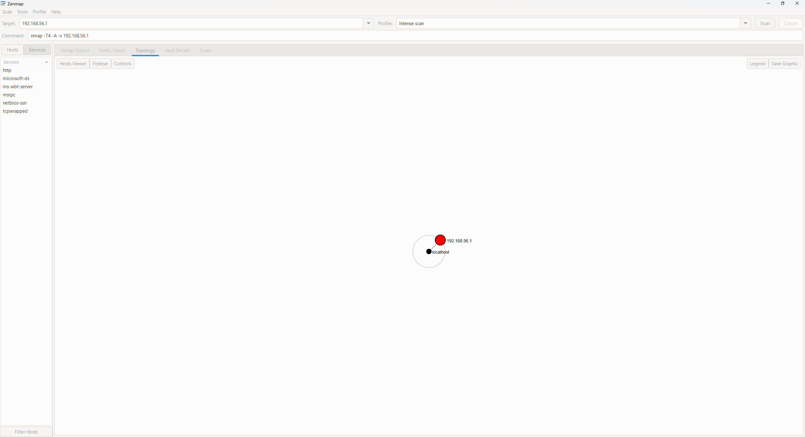
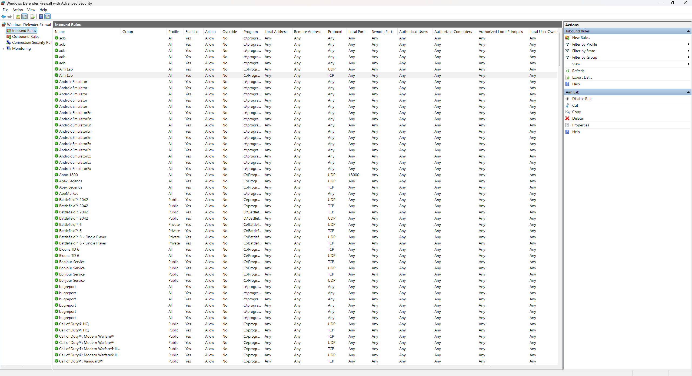
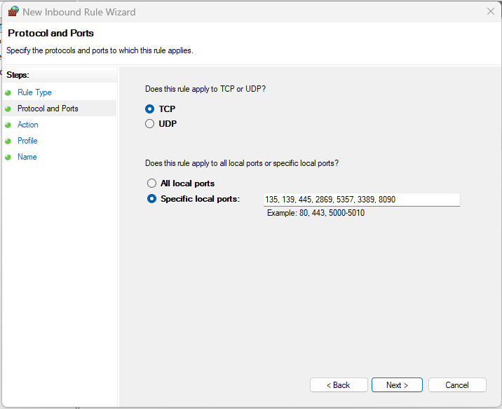
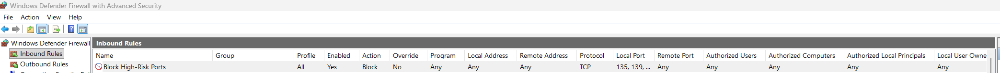

# 🧠 Network Scanning and Mapping Lab

**Author:** Shomoi Francis  
**Date:** 2025-11-07 04:59 UTC  
**Category:** Cybersecurity | Vulnerability Assessment | Network Hardening  
**Tools Used:** Nmap · Zenmap · Windows Firewall  
**Skills Demonstrated:** Vulnerability Identification · Port Analysis · System Hardening · Network Security Basics  

---

## 🔍 Overview

This lab focuses on using **Nmap** to identify open ports, active services, and potential vulnerabilities on a test Windows network.  
The purpose was to understand how exposed services can increase attack surface and to learn how to mitigate these issues through proper firewall configuration and system hardening.

---

## ⚙️ Scan Details

**Command Used:**  
```bash
nmap -T4 -A -v 192.168.56.1
```

**Results:**  
The scan detected several open ports including:

| Port | Service | Description |
|------|----------|-------------|
| 135  | MS RPC | Remote procedure call interface |
| 139  | NetBIOS-SSN | File/printer sharing |
| 445  | Microsoft-DS | SMB file sharing |
| 2869 | HTTPAPI | UPnP/SSDP services |
| 5357 | HTTPAPI | Microsoft HTTP service |
| 3389 | RDP | Remote Desktop Protocol |
| 8090 | Unknown | Service requires investigation |

---

## ⚠️ Findings

- **RDP (3389):** Remote Desktop was open and using a self-signed certificate — could allow brute-force or MITM attacks.  
- **SMB/NetBIOS (135, 139, 445):** File-sharing ports were open and SMB signing wasn’t required.  
- **UPnP/HTTPAPI (2869, 5357):** Exposed unnecessary services that could be abused for discovery or lateral movement.  
- **Port 8090:** Unknown service responding; further identification required.  
- **Information Leakage:** Host and domain info visible in NTLM responses.

---

## 🧩 Why It Matters

Leaving RDP, SMB, or UPnP ports exposed can make a host easy to exploit. Attackers often target these for remote access, lateral movement, or ransomware deployment.  
This lab demonstrates how quick identification and mitigation reduce risk before exploitation occurs.

---

## 🔧 Remediation Steps

I used **Windows Defender Firewall** instead of the command line to block the risky ports.

**Steps Taken:**
1. Opened *Windows Defender Firewall with Advanced Security*.  
2. Navigated to **Inbound Rules → New Rule → Port**.  
3. Selected **TCP**, entered ports `135, 139, 445, 2869, 5357, 3389, 8090`.  
4. Chose **Block the connection** and applied it to all profiles (Domain, Private, Public).  
5. Verified the rules were active and tested using Nmap re-scan (ports returned as *filtered*).

**Additional Hardening:**
- Enabled **Network Level Authentication (NLA)** for RDP.  
- Disabled **SMBv1** and enforced SMB signing.  
- Turned off **UPnP** and **SSDP** services.  
- Checked port **8090** to identify the running process and secured it.  
- Replaced self-signed certificates with trusted ones.

---

## 🧠 Lessons Learned

This lab helped me practice real-world network enumeration and hardening.  
I learned how to interpret scan results, identify exposed services, and apply practical mitigations using built-in Windows tools.  
It also reinforced how **basic firewall management and protocol configuration can dramatically reduce attack surface.**

---

## 🧱 Screenshot Placeholder

Here's some screenshots from my Zenmap scan and Windows Firewall configuration:

```markdown








```

---

## 📁 Files in This Project

- `Network Scanning & Mapping Lab.docx` — Original report write-up  
- `Network_Scanning_and_Mapping_Lab_Report_Shomoi.pdf` — Polished PDF version  
- `Network-Scanning-and-Mapping-Lab.md` — GitHub Portfolio Page (this file)

---

## 🏁 Summary

This project shows my ability to perform vulnerability analysis, interpret Nmap results, and implement remediation on Windows systems.  
It reflects practical cybersecurity skills I continue to build as part of my journey toward becoming a SOC or Vulnerability Analyst.

---

> **“Security isn’t about tools — it’s about understanding exposure and taking action.” — Shomoi Francis**
