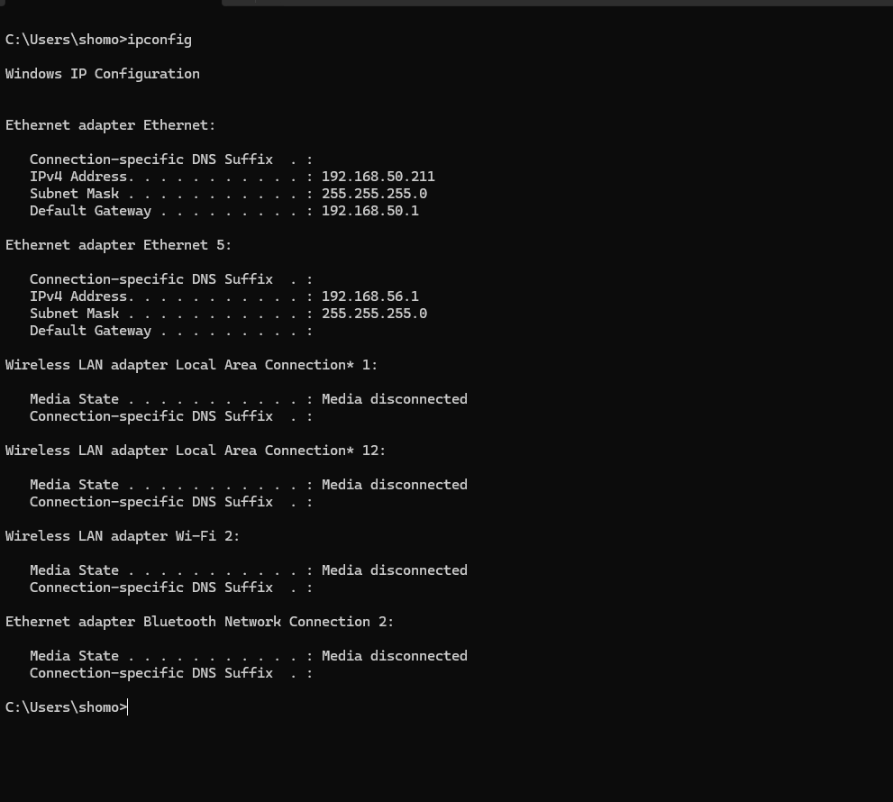
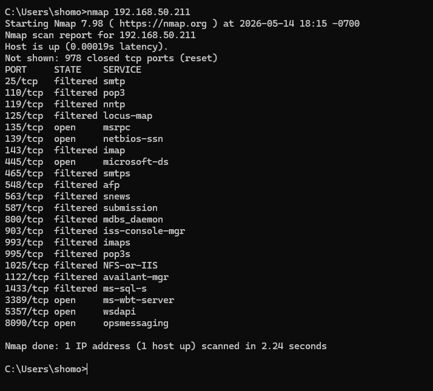
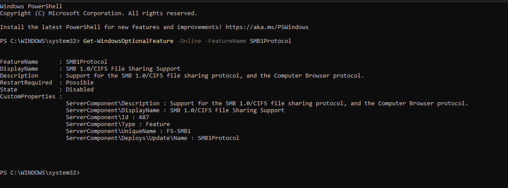
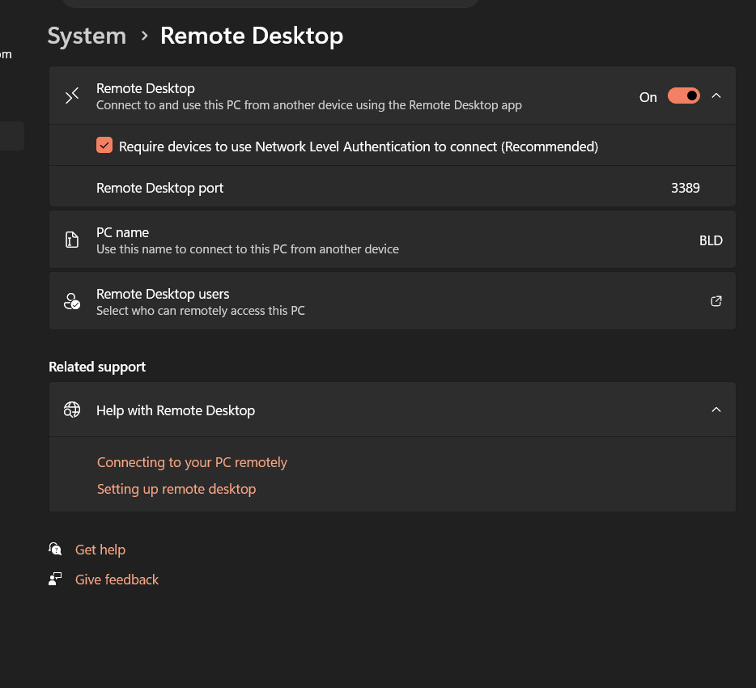
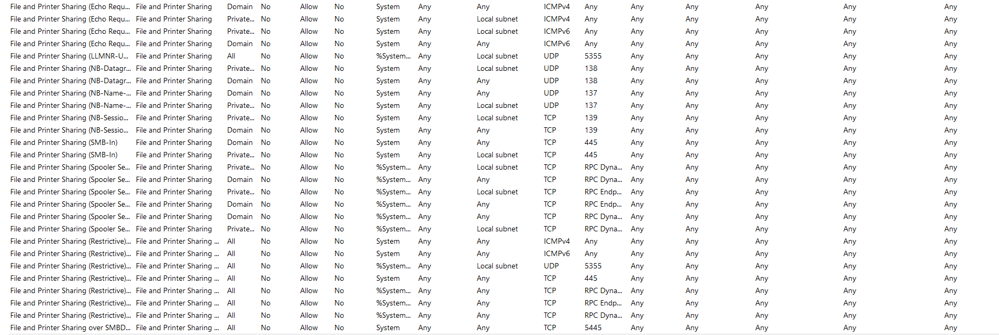
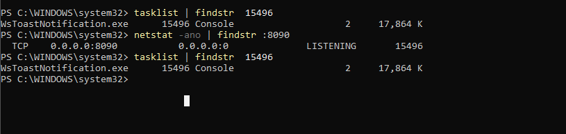
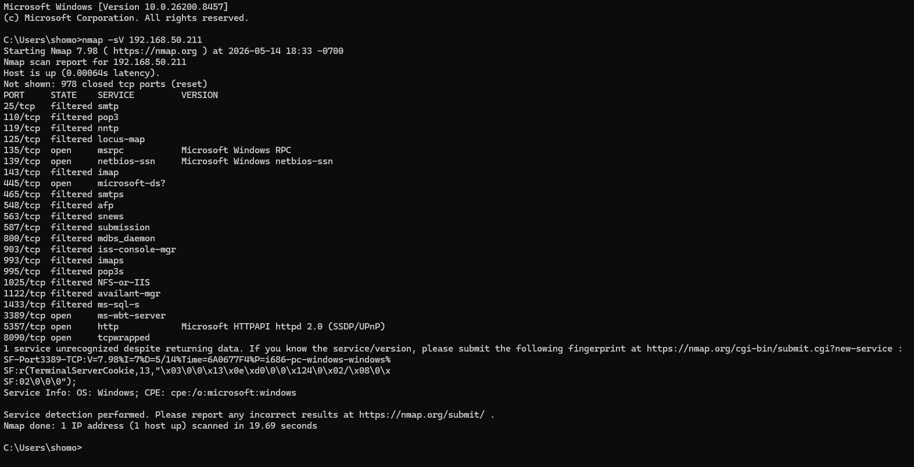
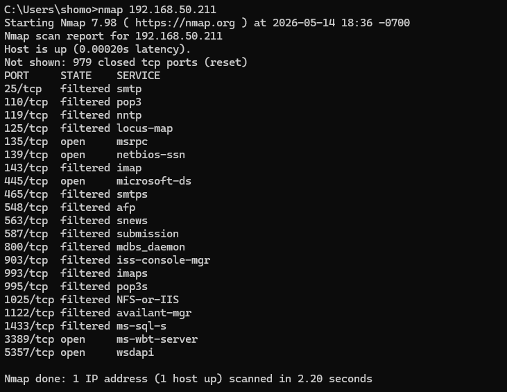

# Network Scanning and Service Enumeration Lab

## Project Overview

This lab demonstrates how Nmap can be used to identify open ports, enumerate services, and analyze the attack surface of a Windows workstation in a controlled home lab environment.

The purpose of this project was to practice basic cybersecurity assessment techniques, document exposed services, review firewall behavior, and provide remediation recommendations based on scan results.

## Tools Used

Nmap  
Windows Command Prompt  
Windows PowerShell  
Windows Defender Firewall  
Windows 11 Workstation  

## Lab Environment

Target IP Address: `192.168.50.211`  
Target System: Windows Workstation  
Network Type: Home lab network  

## Step 1: Identify the Target IP Address

I first used the `ipconfig` command to identify the IPv4 address of the Windows workstation.

```cmd
ipconfig
```

Screenshot:



## Step 2: Run a Basic Nmap Scan

I performed a basic Nmap scan against the Windows workstation to identify open and filtered ports.

```cmd
nmap 192.168.50.211
```

Screenshot:



## Step 3: Analyze Scan Results

The scan identified the following open ports:

| Port | State | Service | Description |
|---|---|---|---|
| 135/tcp | Open | msrpc | Microsoft Remote Procedure Call |
| 139/tcp | Open | netbios-ssn | NetBIOS Session Service |
| 445/tcp | Open | microsoft-ds | SMB File Sharing |
| 3389/tcp | Open | ms-wbt-server | Remote Desktop Protocol |
| 5357/tcp | Open | wsdapi | Web Services Discovery |
| 8090/tcp | Open | opsmessaging | Application specific service |

Several additional ports appeared as filtered, which means traffic was likely being blocked or restricted by firewall rules.

## Step 4: Review SMB Exposure

Port `445` was open, which indicates that SMB file sharing was accessible on the local network.

SMB is commonly used for file sharing, printer sharing, and Windows administrative communication. However, it is also commonly targeted by attackers for lateral movement and exploitation when systems are misconfigured or unpatched.

I checked whether SMBv1 was enabled using PowerShell:

```powershell
Get-WindowsOptionalFeature -Online -FeatureName SMB1Protocol
```

Screenshot:



Recommended remediation:

Disable SMBv1 if enabled.  
Restrict SMB access to trusted networks only.  
Keep Windows fully patched.  
Disable file sharing if it is not required.

## Step 5: Review Remote Desktop Exposure

Port `3389` was open, which indicates that Remote Desktop Protocol was accessible.

RDP allows remote access to a Windows system, but it can become a security risk if exposed to untrusted networks or protected with weak credentials.

To check Remote Desktop settings, I opened:

```text
Settings → System → Remote Desktop
```

I verified whether Remote Desktop was enabled and confirmed whether Network Level Authentication was required.

Screenshot:



Recommended remediation:

Disable Remote Desktop if not needed.  
Enable Network Level Authentication.  
Use strong passwords.  
Restrict RDP access using firewall rules.  
Avoid exposing RDP directly to the internet.

## Step 6: Review Windows Defender Firewall Rules

I reviewed Windows Defender Firewall inbound rules to understand why certain services were open or filtered.

I opened the firewall management console using:

```cmd
wf.msc
```

Then I reviewed inbound rules related to:

SMB  
Remote Desktop  
NetBIOS  
RPC  
Web Services Discovery  

Screenshot:

 

Important rules reviewed:

| Rule Type | Related Port | Security Concern |
|---|---|---|
| File and Printer Sharing | 445 | SMB exposure |
| Remote Desktop | 3389 | Remote access exposure |
| NetBIOS | 139 | Legacy Windows networking |
| RPC | 135 | Windows service enumeration |

The firewall review helped determine which services were allowed through the host firewall and which services were being filtered.

## Step 7: Investigate Port 8090

Port `8090` was open and labeled as `opsmessaging`. Since this was not a standard Windows service I immediately recognized, I investigated which process was using the port.

I used the following command:

```cmd
netstat -ano | findstr :8090
```

Then I used the process ID to identify the application:

```cmd
tasklist | findstr <PID>
```

Screenshot:



Recommended remediation:

Identify the application using the port.  
Disable the service if it is not needed.  
Restrict access using firewall rules.  
Document why the service is running.

## Step 8: Perform Service Version Detection

To gather more detail about the detected services, I ran a service version scan.

```cmd
nmap -sV 192.168.50.211
```

Screenshot:



This helped identify service details that could be useful during vulnerability analysis.

## Step 9: Run an Nmap Vulnerability Scan

To identify potential vulnerabilities associated with exposed services, I performed an Nmap vulnerability scan using the Nmap Scripting Engine (NSE).

I used the following command:

```cmd
nmap --script vuln 192.168.50.211
```

## Vulnerability Scan Screenshot



## Scan Results

The scan checked exposed SMB related services for known vulnerabilities and insecure configurations.

Results included:

```text
smb-vuln-ms10-061: false
```

This indicated that the system did not appear vulnerable to the Microsoft Print Spooler vulnerability associated with MS10-061.

Additional SMB negotiation errors were returned during the scan:

```text
Could not negotiate a connection: SMB: Failed to receive bytes: ERROR
```

This likely occurred because modern Windows SMB security protections prevented older NSE scripts from fully communicating with the service.

## Findings

| Finding | Risk Level | Recommendation |
|---|---|---|
| SMB exposed on port 445 | High | Disable SMBv1 and restrict SMB access |
| RDP exposed on port 3389 | High | Enable NLA and restrict RDP access |
| Nessus service detected on port 8090 | Low | Restrict access and keep Nessus updated |
| Multiple filtered ports detected | Low | Firewall filtering appears active |

## Summary

This scan demonstrated how Nmap NSE scripts can be used to assess exposed services and identify potential vulnerabilities. Although no confirmed critical SMB vulnerabilities were detected, the scan provided insight into SMB protections, firewall behavior, and attack surface exposure.

## Validation

After applying remediation steps, I would run another Nmap scan to verify that unnecessary ports were closed or restricted.

```cmd
nmap 192.168.50.211
```

The before and after results can be compared to confirm that the system’s attack surface was reduced.

Screenshot:


## Skills Demonstrated

Network scanning  
Service enumeration  
Windows attack surface analysis  
Firewall rule review  
SMB security analysis  
RDP exposure review  
Basic vulnerability assessment  
Security documentation  
Remediation planning  
Validation scanning  

## Summary

This lab demonstrated how to perform basic network scanning and service enumeration against a Windows workstation using Nmap. The scan identified open services such as SMB, RDP, RPC, NetBIOS, Web Services Discovery, and an unknown application service on port 8090.

By reviewing the scan results and Windows Defender Firewall inbound rules, I was able to analyze potential security risks and recommend hardening steps to reduce the workstation’s attack surface.
